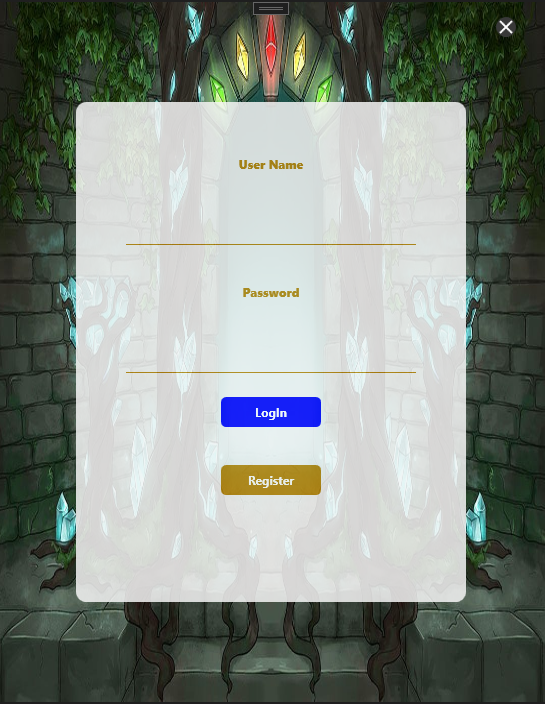
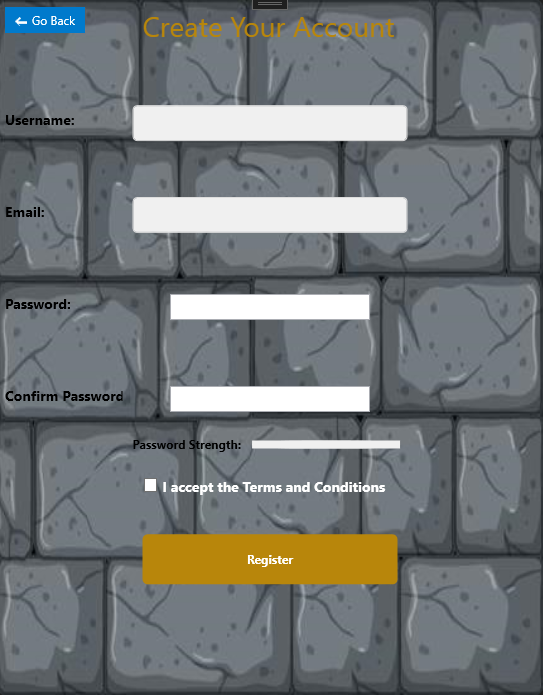
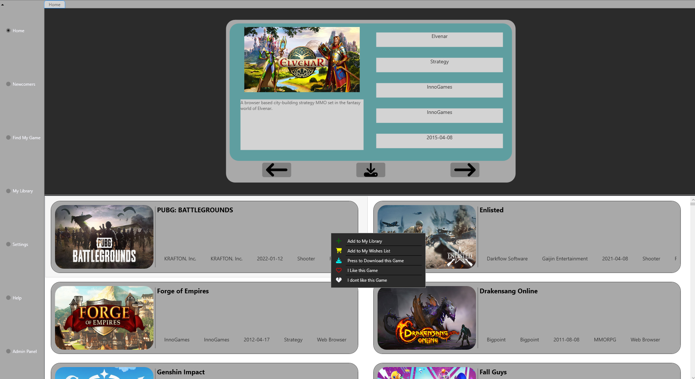
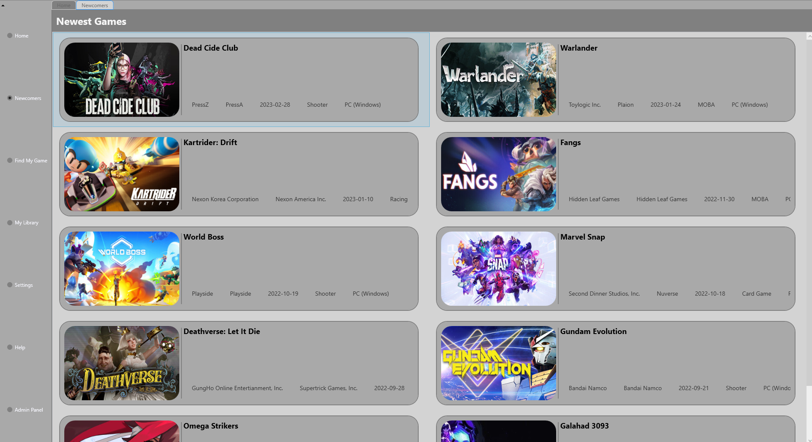
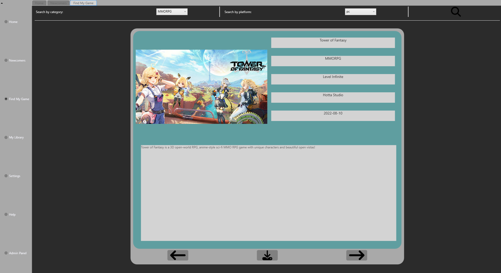
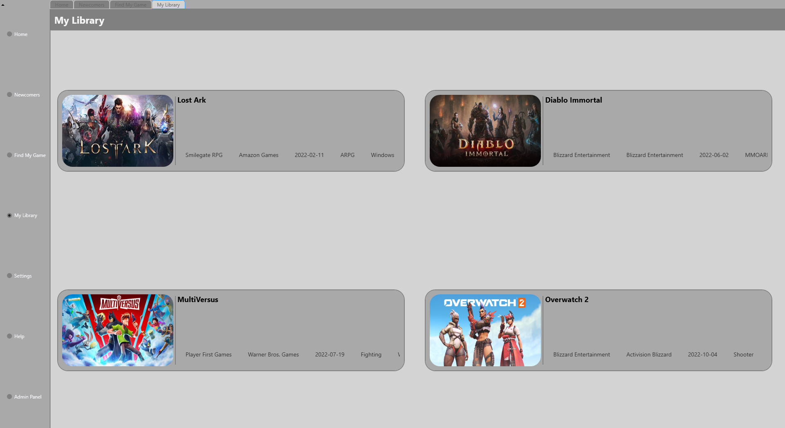
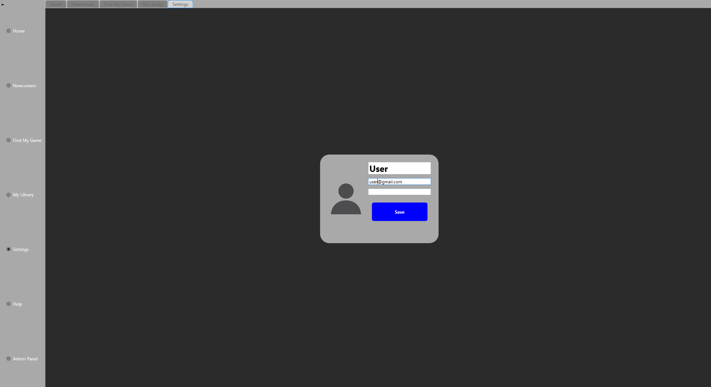
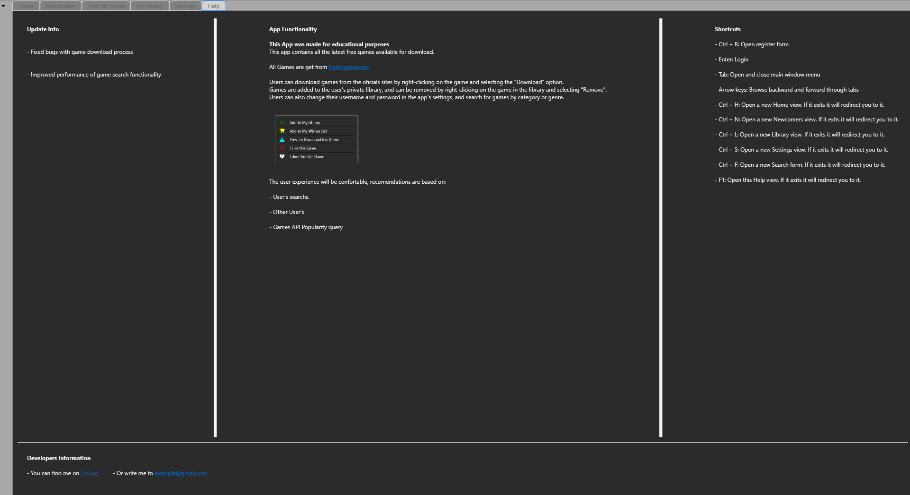
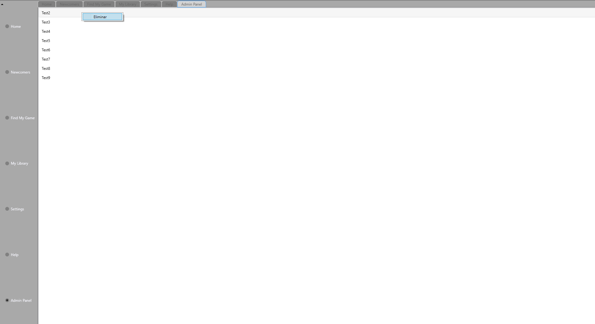

# ProjectDI

This project is for educational purposes and has been developed for the interface development course. It is not intended to privatize, nor to obtain any concrete profit. 
The present code can be used in other projects. However, it is suggested to consult the terms of the attached license to make good use of it.

## Characteristics

- All the games information is taken from: [FreeToGame API](https://www.freetogame.com/api-doc)
- The LogIn Background and Register Background pictures were taken from Google. (They are not included on the project in case they have any License change, but you can   replace them by your own images).
- Recomendation based on the likes users give to the games in the app.
- Active recharge in case the 3 more liked games change. (This was thought in case you have a host and your users access concurrently your database).
- In this example the Data Base used is an SQLite.
- Users can add to their own personalize Library the games from the Home tab.
- Users can change their profile in the settings tab. (Profile picture funtionality is not implemented. However, you can implement using a Blob type in your DB and       MemoryStream to read it in your app).
- Admin Panel lacks design. However, the functionality is implemented.

## Screenshots
### LogIn 

### Register

### Home

### Newcomers

### Find My Game

### My Library

### Settings

### Help

### Admin Panel

## Additional

- Do not forget to configure the data base in order the needs you may have. If you want to follow this example you can install a SQLite DB.

## SQL

- Click [here]()
